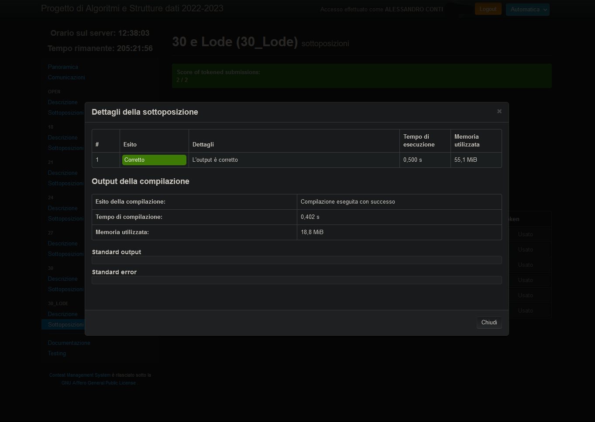

# Progetto_API_2023 - CercaPercorso


Author: Alessandro Conti - [AlessandroConti11](https://github.com/AlessandroConti11)

License: [MIT license](LICENSE).

Tags: `#algorithm`, `#C`, `#data_structure`, `#polimi`, `#prova_finale`, `#software_engineering`.


## University

Politecnico di Milano.

Academic Year: 2022/2023.

052509 - Prova Finale (Progetto di Algoritmi e Strutture Dati) - professor Barenghi Alessandro.


## Specification

_Specification overview_: 
- find the path to travel from A station to B station;
- manage service stations on the highway.

Project specifications in full are in the folder: *Specifiche/*.

The test cases provided to verify the correctness and timing of the project in the implementation phase can be found in the folder: *Specifiche/Open_Test_Case/*.


## How to run

To ensure that the project works properly, you must compile it and run it in a Unix environment from the terminal by following these steps:

0. install gcc 
    ```bash
    sudo apt-get install gcc 
    ```
1. compile the project
    ```bash
    gcc -Wall -Werror -O2 -g3 main.c -o EXECUTABLE 
    ```
2. run the project
    ```bash
    ./EXECUTABLE
    ```

<br>

The Makefile in the repository can also be used to compile the code.
 - this option allows you to compile with the following tags: *-Wall -Werror -O2 -g3*
     ```bash
     make compile
     ```
 - if you want to specify different tags, you can set them
    ```bash
    make compile CFLAGS=YOUR_FLAGS
    ```
- if you want to use Address SANitizer 
    ```bash
    make asan
    ```

   
## Final consideration

Final Evaluation: **30L/30**

Timing:
- Execution Timing = **0.500 s**
- Memory Used = **55.1 MiB**


